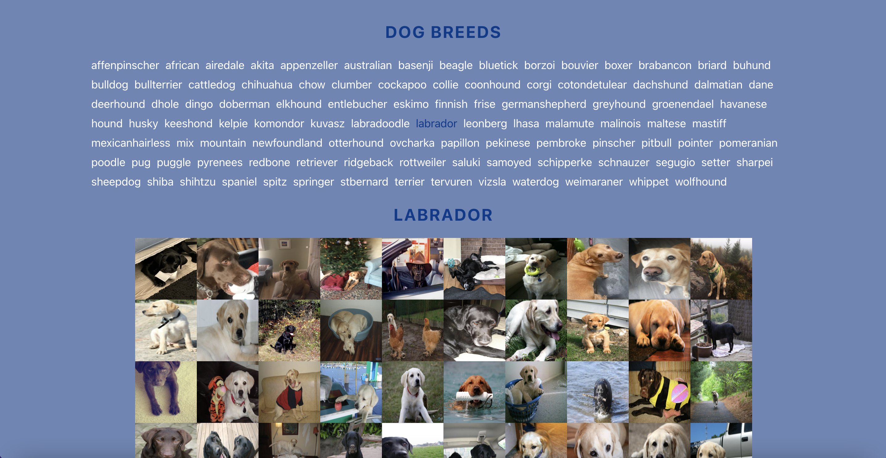

# Dog Image Generator

I created an app which allows users to click on a certain breed of dog and see a collage of related dog images. I built it in React using class components and implemented fetch calls using the Dog API.

# Technologies

- React using class components
- Fetch API

# Dog API & Endpoints

https://dog.ceo/dog-api/documentation/

### App Link:
[Dog Image Generator]([http://the-greeda.s3-website.ap-northeast-2.amazonaws.com/](http://dog-image-generator.s3-website-us-west-2.amazonaws.com/))

### Screenshots:

